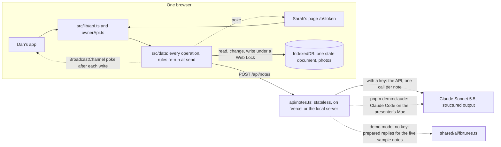

# Nod

Small Australian builders agree job changes ("variations") in a 30-second chat on site, and the paperwork happens later or never. That's where money leaks, and it's how homeowners end up with surprise bills. Nod closes the gap:

- Dan says the change into his phone.
- Claude drafts a structured card (on the public demo, from prepared replies: see below).
- Plain-code NSW, QLD and VIC rules check it.
- Dan sets the price and texts a link.
- The homeowner approves with a typed name.
- Dan's screen updates live.

A take-home for Nex Digital (AI Product Design Engineer, Stage 2) by Rido Hendrawan, built with Claude Code ([how AI was used](AI-USAGE.md)). **Live: https://nod-good.vercel.app**

> **A browser-only prototype.** The data lives in your browser, so Sarah's page opens beside Dan's, in the same browser. In a pilot, a hosted database behind one file lets her approve on her own phone (see the last section).
>
> **Demo mode.** The public site has no AI key. The five sample notes on the Record screen draft from replies prepared in advance, and the screen labels them as demo drafts. Everything after the draft is real code: the quote check, the state rules, the totals and the fingerprint Sarah approves. Any other note gets "This demo drafts the five sample notes only", with **Fill it in by hand** or **Show the sample notes**. With `ANTHROPIC_API_KEY` set, the same function asks Claude to draft any note.
>
> **Live AI in the presenter's demo.** `pnpm demo:claude` runs Nod on the presenter's own Mac, and Claude drafts every note live through Claude Code on their own Claude plan, with no API key. Every tool is switched off, and the reply goes through the same schema and guardrails as the API version. A personal plan can't power a public product, so the public link stays in demo mode.

## Try it

Open **https://nod-good.vercel.app** on a computer: Dan's phone and Sarah's side by side. On a phone, the same link opens Dan's app, and Sarah's page opens in another tab of the same browser (Copy link on the Sent sheet, then paste it into a new tab).

1. On Sarah's kitchen job (QLD), Dan taps **Record a change**, then **Try a sample note** and **One change**: "Sarah's asked for an extra double power point on the end of the island bench. Two-twenty all up, won't hold us up." Then **Draft the variation**.
2. Nod drafts the card. The price is $220, with "You said 'Two-twenty all up'" under it. The Queensland checklist shows one gap, when it's paid, and Send names it.
3. Dan picks "With the next progress claim", signs and sends, and texts Sarah the link.
4. Sarah reads the change in plain words: it adds $220, her new total is $49,170, and "Dan won't start this work until you approve it."
5. She types her full name, ticks the consent sentence and approves. She gets a record number.
6. Dan's screen flips to Approved within a second or two.

**Every screen on its own:** https://nod-good.vercel.app/screens lists 28 links, each one screen with its demo data set up, at phone size. Opening one resets the demo data in that browser.

## How it works



| Layer | Does | Never does |
|---|---|---|
| **AI** (Claude Sonnet 5.5, one call per note; on the public demo, prepared replies for the five sample notes) | Splits the note into changes; writes Dan's wording and Sarah's plain English; quotes Dan's exact words for the price and the days; flags doubts and changes mentioned in passing | Set a price, decide compliance, send, sign |
| **Rules** (plain TypeScript in `shared/`) | State checklists picked by contract date (NSW, QLD, and Victoria's old and new rules); the quote check that drops any price Dan didn't say; totals; the fingerprint Sarah approves; versions and locks | Guess |
| **People** | Dan sets or confirms every price, fixes the gaps, signs and sends. Sarah approves, asks or says no. | |

Comments in the code cite design decisions by number (D1–D97) and sections of the spec and research notes. Those working notes aren't in this repo; the comments carry the reasoning the code needs.

## Run it

```bash
pnpm install
pnpm dev          # http://localhost:5173: both phones on a computer, Dan's app on a phone; Sarah's link opens at /o/<token>
```

There's no server to run and no secret needed:

- The data seeds itself in the browser on first open.
- While developing, `/api/notes` answers from fixtures for the five sample notes. Any other note shows the by-hand path.

The public site runs the same way, in demo mode, with no key. For live AI:

```bash
pnpm demo:claude  # http://localhost:4174: every note drafted by Claude Code on this Mac
```

It needs Claude Code installed and signed in, and runs from an ordinary terminal. Or, with an API key: put `ANTHROPIC_API_KEY` in `.env.local` (git-ignored) and run `NOD_AI_MODE=live pnpm dev`, or set the key in the Vercel project and redeploy.

| Variable | Where | What |
|---|---|---|
| `ANTHROPIC_API_KEY` | Vercel project settings (or `.env.local`); not set on the public demo | The only secret, and optional: without it the function runs in demo mode. It lives in the function's environment and never reaches the browser. |
| `NOD_MODEL` | optional | Defaults to `claude-sonnet-5-5` |
| `NOD_AI_MODE` | optional | `fixture` (prepared replies; the default in dev and tests), `live` (always Claude through the API) or `claude-code` (the local servers draft through Claude Code on this machine; `pnpm demo:claude` sets it). Unset: Claude if there's a key, otherwise demo mode. |
| `NOD_CLAUDE_BIN` | optional, local only | The Claude Code command if it isn't `claude` on the PATH |
| `NOD_AI_FALLBACK` | optional | `off` turns off the server-side refusal fallback |

## Checks

```bash
pnpm typecheck && pnpm lint && pnpm test   # types, lint and the unit tests
pnpm e2e                                   # Playwright at 390, 360 and 320 px, with axe (WCAG 2.2 A/AA) on every screen
pnpm eval --claude-code                    # the live-model eval through Claude Code (or pnpm eval with a key)
pnpm smoke                                 # after a deploy: pages, headers, the AI function in demo mode
pnpm smoke:browser                         # after a deploy: the real site in a browser at 390, 360, 320 px
```

The unit tests cover:

- the rules for every state and rule version, including the Victorian 2% boundaries
- the quote check and guardrails
- money and time formatting across the daylight-saving change
- the fingerprint
- the five sample notes end to end through the data layer, and Sarah's whole journey
- the AI reply: tolerant parsing, the demo answer, and Claude Code mode against a stand-in CLI
- the speech rescue, replayed on 19 recorded Chrome sessions
- that no page's code ever carries zod, the Anthropic SDK or a test tool

## From prototype to production

- **Prototype (this):**
  - one browser and demo data
  - the AI step as one stateless function: live through Claude Code in the presenter's demo, and in demo mode on the public site, with prepared drafts for the five sample notes, labelled as such
  - the state rules in code
  - no accounts
- **Pilot (5 to 10 builders, a few months):**
  - **The live AI step on:** the key in Vercel with a spend limit, `pnpm eval` on real notes, and the prompt tuned on what builders actually say.
  - **A hosted database behind `src/lib/api.ts`**, so Sarah approves on her own phone. Every screen reaches the data through that one file, so the screens don't change.
  - Builder logins, real SMS with a one-time code for Sarah, and a lawyer's review of each state's wording.
  - Better speech to text for noisy sites, and a rate card so prices come faster.
  - Measure the share of changes signed before the work starts, the time from recording to approval, and disputes.
- **Production:**
  - export to Xero and Buildxact, and offline-first capture
  - record retention and export
  - a security review and an accessibility audit
  - more states (WA and SA are one rules file each)
